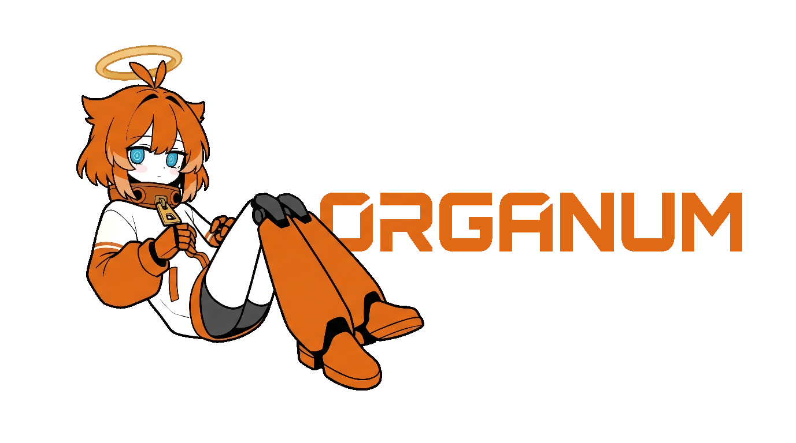

<div align="center">
  
  <h1>Organum</h1>
  <p>UTAU resampler engine written in Rust</p>

  
</div>

---

[한국어](README.md) | [English](docs/en/README.md) | [日本語](docs/ja/README.md)

Organum은 UTAU 및 OpenUtau용 리샘플러 엔진입니다. WORLD vocoder 기반의 분석/합성 파이프라인을 Rust로 구현했습니다.

## Features

- WORLD vocoder 기반 스펙트럼 분석 및 합성
- Rayon을 이용한 병렬 처리
- `organum.yaml`을 통한 설정 커스터마이징
- Zstd 압축 캐시 (`.ogc`)로 반복 분석 생략

## GPU Route Notice

- `gpu-warp` 경로는 **실험적 기능**입니다.
- 현재 구현은 GPU 왕복 오버헤드(업로드/리드백)로 인해, 실사용 구간에서 CPU(SIMD/병렬)보다 **느릴 수 있어 권장하지 않습니다**.
- 기본값은 비활성화(`gpu_warp_enabled: false`)이며, 특별한 벤치/실험 목적이 아니면 CPU 경로 사용을 권장합니다.

## Installation

1. [Releases](https://github.com/KakouLabs/Organum/releases) 페이지에서 바이너리를 다운로드합니다.
   - 각 플랫폼별로 `*-cpu`(기본 CPU 빌드)와 `*-cpu-gpu`(`gpu-warp` 기능 포함) 아카이브가 제공됩니다.
   - `organum-wavtool`은 현재 Windows에서만 제공합니다. Linux/macOS 아카이브에는 `organum-resampler`, `caching-tool`만 포함됩니다.
   - 최신 릴리즈에는 벤치 요약/로그 asset이 함께 포함될 수 있습니다.
2. OpenUtau의 `Resamplers` 디렉토리에 배치합니다.

## Usage

OpenUtau 또는 UTAU에서:

1. `organum-resampler`를 Resampler로 설정
2. Windows에서는 `organum-wavtool`을 Wavtool로 설정
3. Linux/macOS에서는 다음 중 하나를 사용
   - `wine organum-wavtool.exe`로 Windows wavtool 실행
   - OpenUtau 기본 wavtool 사용

### Logging

세 바이너리 모두 구조화 로그를 지원합니다.

- `--verbose`: 디버그 레벨 로그 활성화
- `--log-format pretty|json`: 로그 출력 형식 선택

예시:

```powershell
./organum-resampler --verbose --log-format json ...
./organum-wavtool --log-format json ...
./caching-tool.exe --verbose --log-format json "C:\Path\To\Your\Voicebank"
```

```bash
wine organum-wavtool.exe --log-format json ...
```

### Voicebank 캐싱

캐싱 툴로 voicebank를 미리 분석해두면 렌더링 시 분석 단계를 건너뜁니다.

```powershell
./caching-tool.exe "C:\Path\To\Your\Voicebank"
```

## Configuration

실행 시 `organum.yaml`이 없으면 기본값으로 자동 생성됩니다.

```yaml
feature_extension: "ogc"
sample_rate: 44100
frame_period: 5.0
zstd_compression_level: 3
compressor_threshold: 0.85
compressor_limit: 0.99
gpu_warp_enabled: false
gpu_warp_min_frames: 18446744073709551615
gpu_ap_min_frames: 18446744073709551615
```

캐시는 포맷/스키마/엔진 버전 및 주요 설정(`sample_rate`, `frame_period`)이 현재 실행 값과 다르면 자동으로 무효화 후 재생성됩니다.

자세한 내용은 [Configuration Guide](docs/CONFIGURATION.md) 참고.

SIMD 검증/벤치 가이드는 [SIMD Validation](docs/SIMD_VALIDATION.md) 참고.

## Build

Organum은 단일 릴리스 프로파일(`release`)을 사용합니다.

```bash
cargo build --workspace --release
```

```powershell
./build.bat
```

```bash
./build.sh
```

## Comparison

Kasane Teto UTAU voicebank 기준, 약 500ms 세그먼트 처리 시간.

| Engine | Language | Multithreading | Avg. Time |
| :--- | :--- | :--- | :--- |
| Organum | Rust | Yes (Rayon) | ~25ms |
| straycat-rs | Rust | Yes | ~35ms |
| tn_fnds | C++ | No | ~110ms |

| Feature | Organum | straycat-rs | tn_fnds |
| :--- | :--- | :--- | :--- |
| Acoustic Model | WORLD | WORLD | WORLD/Classic |
| Configuration | YAML | TOML | CLI Only |
| License | MIT | MIT | GPL |

오디오 샘플 비교는 [Comparison](docs/COMPARISON.md) 참고.

## Flags

렌더링 파라미터를 플래그로 제어할 수 있습니다. `P`와 `y`는 동일한 Peak 파라미터 별칭입니다. 상세 레퍼런스: [Flags](docs/FLAGS.md)

## License

MIT
